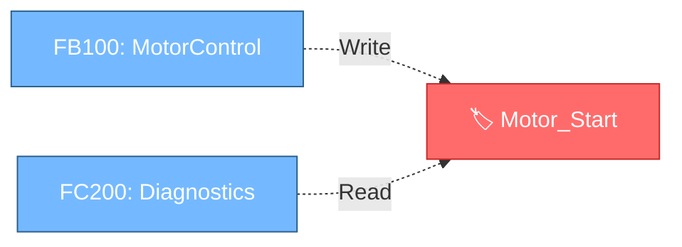
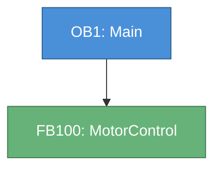

# Call Graph — Visual Network Diagrams from References

## Overview

Generates **Mermaid flowchart diagrams** from TIA Portal reference data: call trees, tag-usage graphs, and block dependency maps, rendered directly in chat.

## When to Use

- "Show me the call tree for OB1"
- "What does FB100 call?"
- "Show me which blocks use the Motor_Start tag"
- "Map the dependencies for PLC_1"
- "Visualize the call structure of PLF_03A"

## Tool Sequence

### Step 1: Identify the scope

Call `list_plcs` to learn the exact PLC names (device name + PLC-software name). Then `list_blocks` with the target `plcName` to confirm which blocks exist — this is far cheaper than `browse_project_tree`.

### Step 2: Gather relationship data — pick by graph type

| Graph you want | Tool to call | Notes |
|---|---|---|
| **Tag usage** (who reads/writes a tag) | `tag_usage` first; **escalate to `read_cross_references`** if `skippedProtectedCount > 0` | `tag_usage` works WITHOUT compiling but is blind to know-how-protected blocks. `read_cross_references` reads the COMPILED cross-reference — pierces protection, authoritative read/write locations. |
| **Where a symbol/address is used** | `search_code` | Greps all EXPORTED block source. Use for addresses (`%Q1515.0`), block names, any pattern. Blind to protected blocks (see `skippedProtectedCount`). |
| **Block-to-block calls** | `read_cross_references` with filter `ObjectsWithReferences` | Reads the COMPILED call graph — pierces know-how protection, so it sees calls inside protected blocks. Auto-compiles if needed. If it errors ("requires a compiled project" / compile fails), fall back to `search_code` for the block name. |

> **`tag_usage` and `search_code` grep EXPORTED source text — fast, no compile needed, but BLIND to know-how-protected blocks** (they report `skippedProtectedCount`). Use them first. **When `skippedProtectedCount > 0` and references are 0 (or suspiciously few), ESCALATE to `read_cross_references`** — it reads TIA's COMPILED cross-reference via `CrossReferenceService`, which PIERCES know-how protection and returns the authoritative read/write locations with access classification. It auto-compiles the project if needed. For "which blocks read/write this tag" where blocks are protected, `read_cross_references` is the authoritative source, not a last-resort fallback.

### Step 3: Extract relationships

- **Call tree**: from `search_code('"FB100"')` results, the lines `CALL "FB100"` / `"FB100"( ... )` reveal callers/callees.
- **Tag usage**: from `tag_usage`, group references by block; `access: write` vs `access: read` distinguishes producers/consumers.
- **Data flow**: tag references across multiple blocks show the data path.

### Step 4: Generate Mermaid diagram

Output a fenced code block with `mermaid` language identifier.

## Mermaid Syntax Rules

### Node IDs
- Alphanumeric + underscores only (no spaces, dots, hyphens)
- Use the block name directly when possible: `FB100`, `FC201`, `OB1`
- Sanitize special chars: `"Motor Control"` → `Motor_Control`
- Wrap labels in square brackets: `FB100["FB100: MotorControl"]`

### Arrow Styles
- `-->` direct block calls (solid)
- `-.->` data/tag usage (dashed)
- `==>` mandatory/primary calls (thick)

### Directions
- `flowchart TD` (top-down) for call hierarchies — default
- `flowchart LR` (left-right) for tag/data chains

### Styling
```
classDef ob fill:#4a90d9,stroke:#2c5f8a,color:#fff
classDef fb fill:#67b279,stroke:#3d7a4a,color:#fff
classDef fc fill:#e8a838,stroke:#b07820,color:#fff
classDef db fill:#9b7cb8,stroke:#6b4d88,color:#fff
```

## Handling Large Graphs

**More than 15 nodes:**
1. Show only **depth 2** from the root (root + direct callees + their callees)
2. Collapse deeper subtrees: `FB100_Subtree["... 8 more blocks under FB100"]`
3. Tell the user they can ask to expand: *"Graph truncated to depth 2. Ask 'expand FB100' for its full call tree."*

## Graph Types

### Tag Usage Graph (most common)

```

```

### Call Tree

```

```

## Rules

- **Prefer `tag_usage` / `search_code` for speed** — they need no compile. **But when `skippedProtectedCount > 0` and references are 0/few, ESCALATE to `read_cross_references`** — compiled cross-reference pierces know-how protection and is the authoritative source. It auto-compiles if needed.
- **Sanitize node IDs** — Mermaid fails on special characters
- **Color-code by type** — OB=blue, FB=green, FC=orange, DB=purple
- **Keep graphs readable** — max 15–20 nodes, collapse deeper levels
- **Always include a text summary** of what the graph shows
- **Empty results** — say so clearly instead of generating an empty diagram

## Example Interaction

**User**: "Show me which blocks use the Motor_Start tag in PLC_1"

**AI Response**:
1. `list_plcs` → confirm PLC_1's exact name
2. `tag_usage(tag="Motor_Start", plcName="PLC_1")` → references with read/write
3. Group by block; producers (write) → consumers (read)
4. Generate Mermaid `flowchart LR` + text summary
