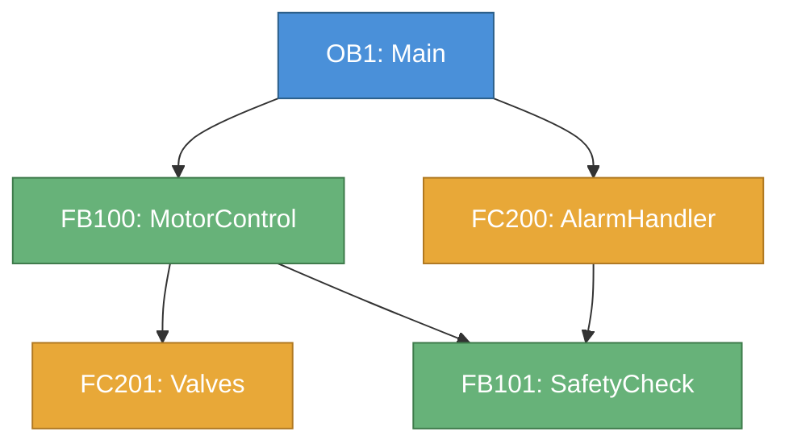
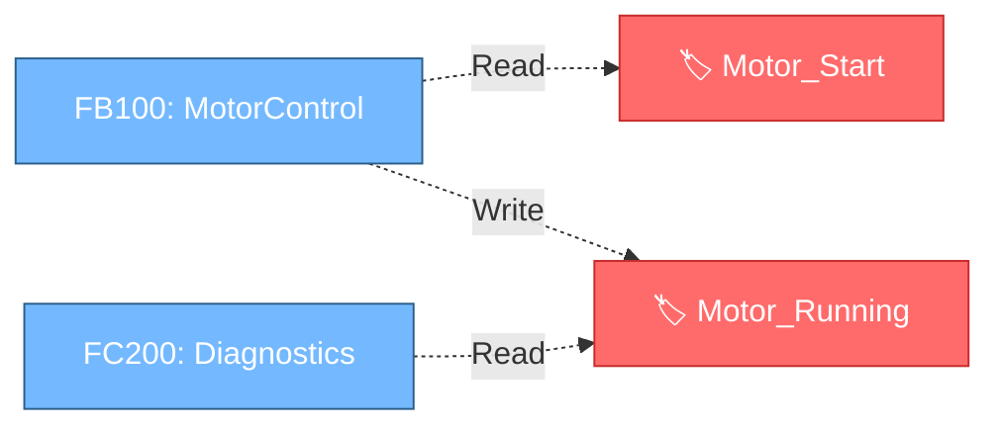

# Call Graph — Visual Network Diagrams from Cross-References

## Overview

This skill generates **Mermaid flowchart diagrams** from TIA Portal cross-reference data. It produces visual call trees, tag usage graphs, and block dependency maps directly in the chat.

## When to Use

- "Show me the call tree for OB1"
- "What does FB100 call?"
- "Show me which blocks use the Motor_Start tag"
- "Map the dependencies for PLC_1"
- "Visualize the call structure of PLF_03A"

## Tool Sequence

### Step 1: Identify the scope

Call `browse_project_tree` to find the PLC name and block folder structure. This tells you what blocks exist and where they are organized.

### Step 2: Get cross-reference data

Call `read_cross_references` with appropriate parameters:

- **For a specific block's call tree**: Use the PLC name and optionally filter to `ObjectsWithReferences`
- **For tag usage graph**: Get all references and filter by tag name in the results
- **For full PLC dependency map**: Get all references without a filter

### Step 3: Extract relationships

From the cross-reference results, filter based on what you need:

| Graph Type | Filter Criteria |
|---|---|
| Call tree | `referenceType === "Calls"` — shows which blocks call which blocks |
| Tag usage | Access type is Read or Write — shows which blocks read/write a specific tag |
| Data flow | `referenceType === "Operates"` or `referenceType === "Uses"` — shows data dependencies |
| Full dependency | All reference types combined |

### Step 4: Generate Mermaid diagram

Output a fenced code block with `mermaid` language identifier.

## Mermaid Syntax Rules

### Node IDs
- Must be alphanumeric with underscores only (no spaces, dots, hyphens)
- Use the block name directly when possible: `FB100`, `FC201`, `OB1`
- For names with spaces or special chars, sanitize: `"Motor Control"` → `Motor_Control`
- Wrap display labels in square brackets: `FB100["FB100: MotorControl"]`

### Arrow Styles
- `-->` for direct block calls (solid arrow)
- `-.->` for data/tag usage (dashed arrow)
- `==>` for mandatory/primary calls (thick arrow)

### Graph Directions
- `flowchart TD` (top-down) for call hierarchies — use this by default
- `flowchart LR` (left-right) for tag usage chains or data pipelines

### Styling
Use `classDef` to color-code block types:
```
classDef ob fill:#4a90d9,stroke:#2c5f8a,color:#fff
classDef fb fill:#67b279,stroke:#3d7a4a,color:#fff
classDef fc fill:#e8a838,stroke:#b07820,color:#fff
classDef db fill:#9b7cb8,stroke:#6b4d88,color:#fff
```

## Handling Large Graphs

**If the result has more than 15 nodes:**

1. Show only **depth 2** from the root block (the block asked about + its direct callees + their callees)
2. Replace deeper subtrees with collapsed placeholder nodes:
   ```
   FB100_Subtree["... 8 more blocks under FB100"]
   ```
3. Tell the user they can ask to expand specific subtrees:
   > "Graph truncated to depth 2. Ask 'expand FB100' to see its full call tree."

**If the graph is very small (< 5 nodes):**
- Show it inline, no special handling needed

## Graph Types

### Type 1: Call Tree

```

```

### Type 2: Tag Usage Graph

```

```

### Type 3: Full Dependency Map

Combine call arrows (`-->`) and data arrows (`-.->`) in one diagram. Use a legend:
```
%% Legend:
%%  ──▶ Block calls
%%  ╌╶▶ Data/Tag reference
```

## Rules

- **ALWAYS call `read_cross_references`** — do not guess or invent call relationships
- **Sanitize node IDs** — Mermaid will fail on special characters
- **Add descriptive labels** — show both block number and name when available
- **Color-code by type** — OB=blue, FB=green, FC=orange, DB=purple
- **Keep graphs readable** — max 15-20 nodes per diagram, collapse deeper levels
- **Provide a text summary** — always include a brief textual explanation of what the graph shows
- **Handle empty results** — if no call relationships found, say so clearly instead of generating an empty diagram

## Example Interaction

**User**: "Show me the call tree for OB1 in PLC_1"

**AI Response**:

1. Calls `browse_project_tree` to confirm PLC_1 structure
2. Calls `read_cross_references` for PLC_1
3. Filters to `referenceType === "Calls"` where source is OB1 or callees of OB1
4. Generates Mermaid flowchart
5. Adds text summary:

> 📊 **Call Tree for OB1 (PLC_1)**
>
> [Mermaid diagram renders here]
>
> **Summary**: OB1 calls 3 blocks directly (FB100 MotorControl, FC200 AlarmHandler, DB_Config). FB100 has the deepest call chain with 4 sub-calls. FB101 SafetyCheck is called by both FB100 and FC200 (shared dependency).
